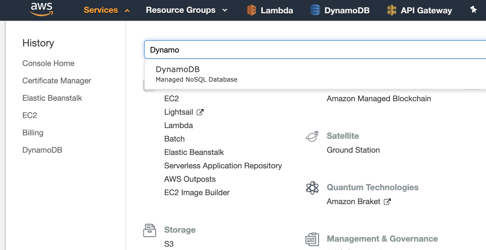
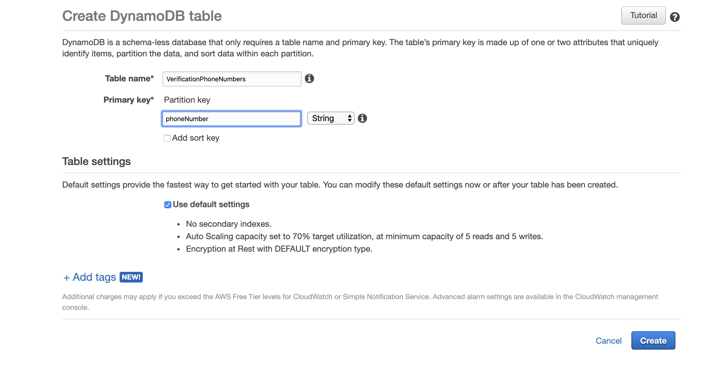

# Logfish server

The Logfish server provides a socket connection for Logfish clients via socket.io. The Logfish npm package simply issues a POST request to this server with data to log and an API key, and the server will send given data to the client socket with the associated API key.

After you setup the server locally, you will need to setup the client locally by following the instructions here: [https://github.com/bandrewfisher/logfish_client](https://github.com/bandrewfisher/logfish_client). After you setup the client, you can download the Logfish npm package to start logging.

## Clone the repository and install dependencies

SSH:

```
$ git clone git@github.com:bandrewfisher/logfish_server.git && cd logfish_server
$ yarn install
```

HTTPS:

```
$ git clone https://github.com/bandrewfisher/logfish_server.git && cd logfish_server
$ yarn install
```

## Set up Twilio Account and environment variables

To enable phone logging, you will need a Twilio account and a Twilio phone number with the ability to send SMS messages. If you do not have a Twilio account, first create one at [https://www.twilio.com/try-twilio](https://www.twilio.com/try-twilio).

Once you have an account, create a new Twilio project and navigate to the project dashboard at [https://www.twilio.com/console](https://www.twilio.com/console). You will need your account SID and auth token.

You will need to add these as environment variables that the server can access. One way to do this is to add a few `export` statements to your ~/.bashrc file (or ~/.bash_profile on Mac). Open up this file in your favorite text editor and add the following lines to the bottom:

```
export TWILIO_ACCOUNT_SID=YOUR_ACCOUNT_SID_HERE
export TWILIO_AUTH_TOKEN=YOUR_AUTH_TOKEN_HERE
```

Paste the actual values for your account SID and auth token where it says YOUR_ACCOUNT_SID_HERE and YOUR_AUTH_TOKEN_HERE.

Finally, you will need to purchase a Twilio phone number with SMS sending capabilities. Navigate to [https://www.twilio.com/console/phone-numbers/search](https://www.twilio.com/console/phone-numbers/search), check the box that says "SMS", and search. Purchase whatever number you want, and then copy the phone number. We will need to add that as an environment variable too.

Open up your ~/.bashrc file again (or ~/.bash_profile for Mac). Add this line:

```
export TWILIO_PHONE_NUM=YOUR_TWILIO_PHONE_NUMBER_HERE
```

Replace YOUR_TWILIO_PHONE_NUMBER_HERE with the phone number you purchased. Make sure it includes the plus sign at the beginning and no spaces. For example, it might look something like +18015551234.

## Set up a Dynamo Database on AWS

The Twilio server uses a Dynamo DB to store phone numbers while waiting for the user to provide a verification code. If you do not have an AWS account, create one by following the instructions at [https://aws.amazon.com/premiumsupport/knowledge-center/create-and-activate-aws-account/](https://aws.amazon.com/premiumsupport/knowledge-center/create-and-activate-aws-account/).

At the top of the AWS console, click on "Services" and then navigate to the Dynamo DB page by searching for "DynamoDB".



Click on the "Create table" button. Call the table "VerificationPhoneNumbers" and call the partition key phoneNumber. Then click "Create".



## Set up AWS credentials locally

You need to have some access keys locally so that you can access the Dynamo table you just made. Follow these instructions to create an IAM user: [https://docs.aws.amazon.com/IAM/latest/UserGuide/id_users_create.html#id_users_create_console](https://docs.aws.amazon.com/IAM/latest/UserGuide/id_users_create.html#id_users_create_console). On step 11, make sure you download a csv files with the access key ID and secret access key.

In your home directory, create a directory called `.aws`.

```
$ mkdir ~/.aws
```

Inside of that folder, create a file called `credentials`.

```
$ touch ~/.aws/credentials
```

Place the following into that `credentials` file:

```
[default]
aws_access_key_id = YOUR_ACCESS_KEY_HERE
aws_secret_access_key = YOUR_SECRET_ACCESS_KEY_HERE
```

Replace the values with the keys in the csv file you downloaded.

## Run the server locally

Move into the directory where you cloned this repository and run:

```
$ yarn start:dev
```

The server should now running on port 8081! (Make sure nothing else is running on that port before doing this).

You can now use the logfish client and npm package to log to your browser and your phone. Note that since you are running the server in development mode, by default the API key will always be DEV_KEY for convenience. If you want to run in production mode, you have a couple options.

The first option is to just change the NODE_ENV environment variable.

```
$ NODE_ENV=production yarn start:dev
```

The second option is to build the Typescript files and run the built files:

```
$ yarn build && yarn start
```
